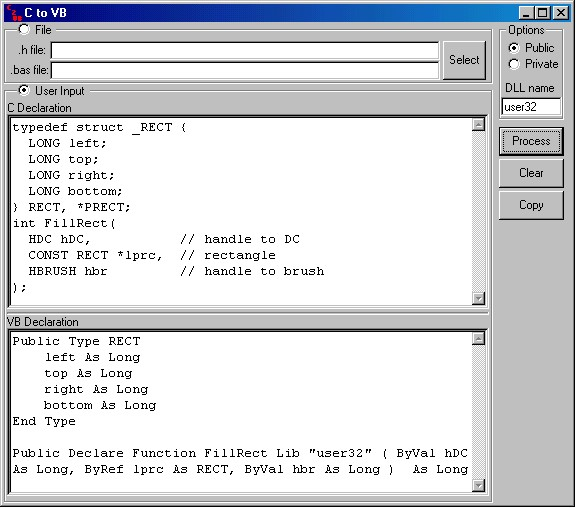



## C2VB

### Description

C2VB parses through C style declarations of functions, structures etc and creates the VB equivalent.

I decided to create this little program to make my life easier when working with APIs.

Instead of having to "translate" an API declaration from the Platform SDK help file, I wanted a way to do that automatically. This is the result.

All you have to do, is copy paste the declaration from the help file.

Apart from being a handy app. it demonstrates how to parse instructions, how to implement a rudimentary splitter and above all, it explains what do all those wierd things mean in C!

It can process either user inputted instructions or it can read from a file.

Optionally, a filename can be passed on the command line.

If you have any comments or disagree with the way I converted the datatypes, let me know.
 
### More Info
 
Released under the GPL.

             |
---                |---
**Submitted On**   |2000-11-02 16:54:10
**By**             |[Kimon Andreou](https://github.com/Planet-Source-Code/PSCIndex/blob/master/ByAuthor/kimon-andreou.md)
**Level**          |Intermediate
**User Rating**    |4.8 (184 globes from 38 users)
**Compatibility**  |VB 5\.0, VB 6\.0
**Category**       |[Miscellaneous](https://github.com/Planet-Source-Code/PSCIndex/blob/master/ByCategory/miscellaneous__1-1.md)
**World**          |[Visual Basic](https://github.com/Planet-Source-Code/PSCIndex/blob/master/ByWorld/visual-basic.md)
**Archive File**   |[CODE\_UPLOAD112271122000\.zip](https://github.com/Planet-Source-Code/kimon-andreou-c2vb__1-12483/archive/master.zip)

### API Declarations

(none)

